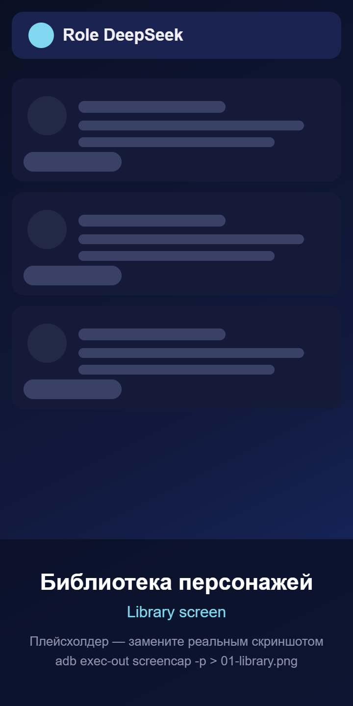
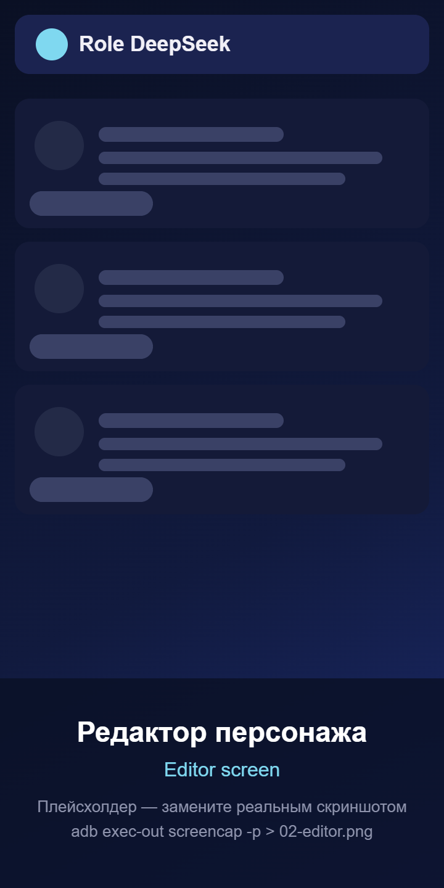
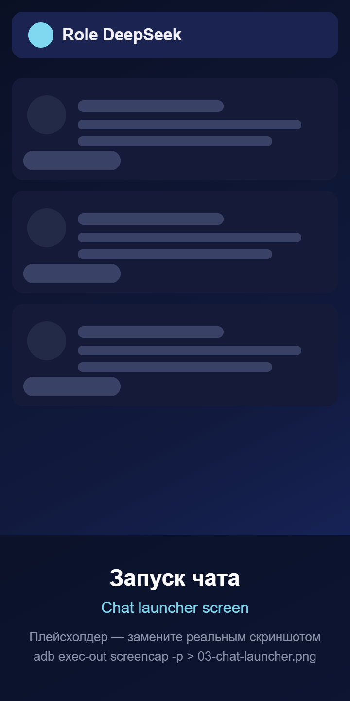
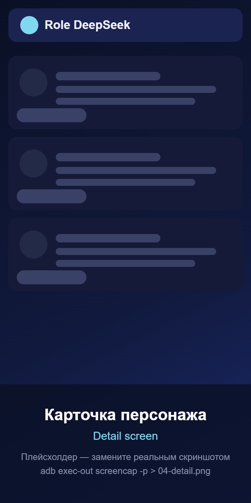
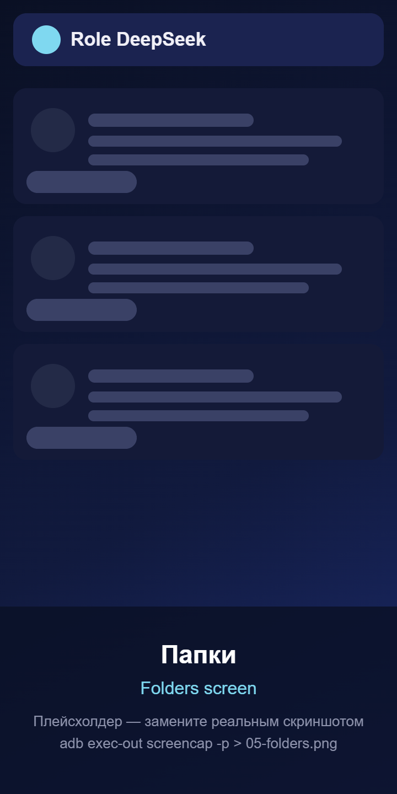
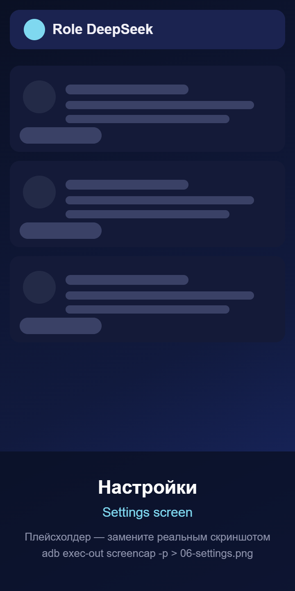

# Role DeepSeek

**Нативное Android-приложение на Kotlin + Jetpack Compose** для ролевых чатов в DeepSeek:
библиотека персонажей с аватарами, промптами и тегами, импорт/экспорт карточек,
резервные копии, папки, статистика и быстрый запуск чата в один тап.

> Текущая версия: **1.1.0-beta** (`versionCode 2`). Метка «beta» видна в шапке библиотеки
> и в настройках — приложение ещё обкатывается, часть багов ловится и правится по ходу.

> Никаких WebView и PWA-обёрток: только Kotlin, Compose и Material 3.

[](https://github.com/pythonistaVP/Role-deepseek/actions/workflows/build.yml)
-3ddc84)


Автор: [pythonistaVP](https://github.com/pythonistaVP) · Репозиторий: [pythonistaVP/Role-deepseek](https://github.com/pythonistaVP/Role-deepseek)

---

## 📱 Скриншоты

| Библиотека | Редактор | Запуск чата |
|---|---|---|
|  |  |  |

| Просмотр персонажа | Папки | Настройки |
|---|---|---|
|  |  |  |

> Изображения в `docs/screenshots/` — плейсхолдеры. Замените их реальными снимками
> экрана (Android Studio → Logcat/Running Devices → кнопка «Camera», либо `adb exec-out screencap -p > shot.png`).

---

## ✨ Возможности

### 🏠 Библиотека персонажей
- Сетка карточек (2–4 колонки) с круглыми аватарами и мягким превью по **BlurHash**
  (аватар появляется без «прыжка» и без белого квадрата).
- Поиск по имени, промпту, тегам, заметке и приветствию: **debounce 300 мс**,
  **нечёткий поиск** («дтк нур» → «Детектив Нуар») и **подсветка совпадений**.
- Фильтр-чипы по папкам («Все», «Закреплённые», «Без папки», папки).
- Сортировка: по дате · по имени · по закреплённым · по частоте использования.
- Контекстное меню карточки (долгое нажатие → иконка «Ещё»): закрепить, переместить в папку,
  дублировать, экспорт `.json`, поделиться, удалить.
- **Массовые операции**: долгое нажатие → режим выбора → переместить / экспорт / удалить.
- FAB «Новый персонаж», импорт `.json` из файла или из буфера обмена, пустое состояние с подсказкой.

### ✏️ Редактор
- Аватар: **«Из галереи»** (системный выбор фото `ActivityResultContracts.PickVisualMedia` —
  разрешения на галерею не нужны) или **«Снять на камеру»** (`TakePicture`, снимок кладётся
  в `cacheDir/camera` через FileProvider) → кроп 1:1 через **uCrop** → удаление.
  Любая ошибка кропа/камеры не роняет приложение: показывается сообщение и, если можно,
  берётся исходное фото. Во время обработки — индикатор загрузки.
- Кнопка **«Вставить»** — вставить промпт из буфера обмена в один тап.
- Имя, промпт (счётчик символов и шаблоны-заготовки), приветствие, теги с автодополнением,
  папка (создание на лету), **температура** (0.0–2.0), **Top-P** (0.0–1.0), заметка автора,
  видимость «публичный/приватный».
- **Автосохранение черновика через 3 секунды** бездействия (DataStore) — можно закрыть приложение.
- Экспорт `.json`, QR-код карточки (сжатый JSON), удаление с подтверждением.

### 💬 Запуск чата в DeepSeek
DeepSeek не даёт публичного API для вставки текста в чат извне, поэтому приложение делает всё,
что возможно:
1. Собирает итоговый промпт: `[приветствие]\n\n[промпт]\n\n[контекст: имя=…, теги=…, temperature=…]`.
2. Копирует его в буфер обмена (`ClipboardManager`).
3. Показывает диалог: «Промпт «Имя» скопирован. Открыть DeepSeek и вставить?».
4. Открывает DeepSeek: сначала приложение `com.deepseek.chat`, затем `https://chat.deepseek.com`,
   затем `https://chat.deepseek.com/a/chat/s/new`.
5. Показывает Snackbar с кнопкой «Показать буфер» и подсказкой «долгое нажатие → Вставить».
6. **Опционально** — плавающая подсказка поверх DeepSeek (`SYSTEM_ALERT_WINDOW`, отдельное
   разрешение, исчезает через 9 секунд; foreground-сервис с тихим уведомлением).

Дополнительно: копирование только приветствия, «Поделиться промптом», кнопка копирования без открытия.

### 📁 Папки
Счётчик персонажей, создание/переименование/удаление (персонажи не теряются), цвет и иконка,
**перетаскивание карточек персонажей между папками** (долгое нажатие + перетаскивание)
и зона «Без папки».

### 👤 Карточка персонажа
Большой аватар, теги, полный промпт с копированием, статистика использования (запуски, копирования,
просмотры, правки, даты), кнопки: начать чат, редактировать, поделиться (текст/файл), экспорт, QR,
дублировать, удалить, «сделать любимым» (для виджета).

### ⚙️ Настройки
- Тема: системная / светлая / тёмная / **Material You** (динамические цвета на Android 12+),
  плавный crossfade при переключении.
- Язык: системный / русский / English (`AppCompatDelegate.setApplicationLocales`, работает и до Android 13).
- **Производительность** (новое в 1.1.0): три готовых профиля в один тап —
  **Качество** / **Баланс** / **Экономия батареи** — и тонкая ручная настройка рядом:
  - колонок в сетке библиотеки;
  - максимальный размер аватара при сохранении (256–1024 px) и качество JPEG (60–100);
  - миниатюры-аватары в списках (меньше памяти) вкл/выкл;
  - BlurHash-превью вкл/выкл;
  - crossfade при загрузке картинок вкл/выкл;
  - размер кэша изображений в памяти (5–50 % от лимита памяти процесса, по умолчанию 25 %)
    и кэша на диске (32–512 МБ, по умолчанию 128 МБ);
  - локальная статистика использования вкл/выкл (когда выключена — события не пишутся).
  Все значения проверяются и зажимаются в допустимые границы (`AppSettings.sanitized()`), а
  размер кэша Coil применяется на лету: `RoleDeepSeekApp` пересобирает `ImageLoader` при
  изменении настроек.
- Экспорт всей библиотеки в один `.json`, импорт бэкапа с выбором **[Заменить всё] [Объединить]**
  (вместе с настройками производительности; старые бэкапы без них читаются нормально).
- Очистка кэша изображений (Coil), сброс настроек, очистка локальной статистики,
  очистка временных файлов кропа и камеры.
- Статистика: персонажи, папки, закреплённые, запуски чата, аватары, размер БД (раздельно
  размер аватаров и размер базы).
- **«О приложении»**: версия (**1.1.0-beta**) + честная заметка, что это beta-сборка, сделанная
  с ИИ; ссылки на GitHub и лицензию MIT, кнопка «Поставить звезду».
- **«Что нового»** — встроенный список изменений (changelog) с 1.0.0 до 1.1.0-beta.

### 🧩 Виджет
«Любимый персонаж» на рабочем столе: аватар, имя и подсказка, тап — сразу запуск чата.

### 🔒 Приватность
Вся библиотека хранится **только на устройстве** (Room + внутреннее хранилище + DataStore).
Приложение не отправляет данные в сеть (единственный сетевой сценарий — загрузка аватара по ссылке
из чужой карточки при импорте, если в ней указан `http(s)`-URL; загрузка ограничена 12 МБ).

---

## 🆕 Что нового в 1.1.0-beta

- **Починен вылет при добавлении фото.** Причина: библиотека uCrop не объявляет свой экран
  `UCropActivity` в манифесте, из-за чего `startActivity` падал с `ActivityNotFoundException`.
  Экран добавлен в `AndroidManifest.xml`; заодно весь путь выбора/кропа обёрнут в обработку
  ошибок, так что сбой кропа больше не роняет приложение.
- **Новый выбор фото без разрешений** — системный `PickVisualMedia` вместо запроса доступа к
  галерее; добавлена съёмка на камеру.
- **Настройки производительности** — профили «Качество / Баланс / Экономия батареи» и ручные
  ползунки (см. раздел «Настройки»). Размер кэша изображений и его поведение применяются сразу.
- **Защита от нехватки памяти (OOM):** большие фото декодируются с понижением (`inSampleSize`),
  аватары при сохранении масштабируются под заданный размер, BlurHash-превью кэшируются
  отдельным LRU-кэшем.
- **Быстрее списки:** фильтрация/поиск/сортировка библиотеки выполняются вне главного потока
  (`Dispatchers.Default`), нечёткий поиск не пересчитывает строку на каждый токен.
- **Больше не теряются черновики:** при выходе из редактора незаконченный черновик
  принудительно сохраняется.
- **Метка beta** в шапке библиотеки и в настройках, встроенный changelog и текст «О приложении».
- Убрана лишняя зависимость (accompanist-permissions) — приложение стало немного легче.
- **Починены ещё несколько падений и ошибок данных** (подробности — в разделе «Решение проблем»):
  - `FOREGROUND_SERVICE` не было в манифесте — плавающая подсказка падала с `SecurityException`
    на **любом** Android 9+;
  - не был указан `foregroundServiceType` — падение на Android 14 (`targetSdk 34`);
  - аватар в виджете мог не влезть в лимит Binder (~1 МБ) и уронить виджет;
  - создание папки с уже существующим именем сносило старую папку (`INSERT OR REPLACE`)
    вместе с привязкой персонажей, а переименование в занятое имя падало с
    `SQLiteConstraintException` — теперь и то, и другое аккуратно отклоняется с сообщением;
  - после сохранения/удаления черновик «воскресал» при выходе с экрана редактора;
  - на чистой установке библиотека показывала 1 колонку вместо 2, а ползунок колонок
    обещал 5, тогда как сетка рисовала максимум 4;
  - при повороте экрана приложение повторно открывало чат/редактор из виджета или «Поделиться»;
  - в системной ночной теме стартовое окно было светлым (мелькало белым).

---

## 🧱 Технологический стек

| Слой | Что используется |
|---|---|
| Язык | Kotlin 2.0.21 |
| UI | Jetpack Compose + Material 3 (BOM 2024.09.02, dynamic color) |
| Архитектура | MVVM + Repository + UseCase |
| Асинхронность | Coroutines + Flow |
| DI | Hilt (dagger-hilt-android 2.52) |
| БД | Room 2.6.1 (KSP) |
| Настройки | DataStore Preferences |
| Изображения | Coil 2.7 |
| JSON | kotlinx.serialization 1.7 |
| Навигация | navigation-compose 2.8 |
| Кроп аватара | uCrop 2.2.8 (JitPack) |
| Выбор фото | `ActivityResultContracts.PickVisualMedia` + `TakePicture` (AndroidX Activity, без доп. библиотек) |
| QR-коды | ZXing core 3.5.3 |
| Сборка | AGP 8.5.2, Gradle 8.7, Kotlin DSL, Version Catalog |
| SDK | minSdk 26, targetSdk/compileSdk 34, R8 + shrinkResources в release |

---

## 📂 Структура проекта

```
Role-deepseek/
├── app/
│   ├── src/main/
│   │   ├── res/                          строки (ru/en), темы, иконки, layout виджета
│   │   └── AndroidManifest.xml
│   ├── build.gradle.kts
│   └── proguard-rules.pro
├── kotlin/com/pythonistavp/roledeepseek/  ← исходники Kotlin (почему здесь — см. ниже)
│   ├── RoleDeepSeekApp.kt        @HiltAndroidApp + Coil
│   ├── MainActivity.kt           сплэш, тема, deep link из виджета и «Поделиться»
│   ├── data/
│   │   ├── local/                Room: entity, dao, конвертеры
│   │   ├── files/                AvatarStore (приватные файлы аватаров)
│   │   ├── datastore/            SettingsDataStore
│   │   ├── repository/           репозитории и мапперы
│   │   └── model/                доменные модели и DTO форматов
│   ├── domain/                   CharacterQuery + usecase-и
│   ├── di/                       Hilt-модули
│   ├── navigation/               Routes и NavGraph (анимации переходов)
│   ├── service/                  FloatingHintService (плавающая подсказка)
│   ├── ui/                       library, editor, chatlauncher, folders, settings,
│   │                             detail, components, theme
│   ├── util/                     Clipboard / Document / Share / QR / BlurHash / поиск
│   └── widget/                   виджет «любимый персонаж»
├── gradle/libs.versions.toml             единый каталог версий
├── build.gradle.kts / settings.gradle.kts / gradle.properties
├── gradlew / gradlew.bat / gradle/wrapper/
├── build_apk.py / build_apk.sh / build_apk.bat   ← сборка APK одной командой
├── .github/workflows/build.yml                   ← автосборка APK в облаке
├── .gitignore
├── LICENSE (MIT) / README.md / RELEASE_NOTES.md
```

> **Про точечные имена файлов.** В редакторе площадки, где собирался проект, нельзя создавать
> файлы и папки, начинающиеся с точки, поэтому там они лежат как `gitignore.txt` и
> `github/workflows/build.yml`. В приложенном архиве они **уже переименованы** в `.gitignore`
> и `.github/workflows/build.yml` — перед push в GitHub ничего переименовывать не нужно.

> **Почему Kotlin-исходники лежат в `kotlin/` в корне, а не в `app/src/main/java`?**
> Так дерево каталогов в разы короче, а пакеты остаются настоящими
> (`com.pythonistavp.roledeepseek.*`) — менять `namespace`, `applicationId` и импорты не нужно.
> Каталог прописан в `app/build.gradle.kts` внутри блока, помеченного
> `// >>> RD_SOURCES_BEGIN … // >>> RD_SOURCES_END >>>`. Этот блок управляется скриптом
> `build_apk.py`: если KSP падает с `error.NonExistentClass`, скрипт сам подставляет другой
> способ подключения каталога (`SRC_VARIANTS` в `build_apk.py`) и повторяет сборку.
> Хотите стандартную раскладку — перенесите `kotlin/com/...` в `app/src/main/java/com/...`
> и удалите блок между маркерами: больше ничего менять не нужно.

---

## 🚀 Сборка

### 0. Самый простой способ — один скрипт (рекомендуется)

Нужен только **Python 3.8+** (https://www.python.org/downloads/, при установке на Windows
поставьте галочку *Add python.exe to PATH*). Больше ничего ставить не надо — JDK 17 и Android SDK
скрипт скачает и настроит сам.

**Windows:** двойной клик по **`build_apk.bat`**
**macOS / Linux:**
```bash
chmod +x build_apk.sh && ./build_apk.sh
```
**Вручную (любая ОС), из корня проекта:**
```bash
python build_apk.py              # debug APK
python build_apk.py --release    # release APK (R8)
python build_apk.py --install    # собрать и сразу поставить на телефон по USB
python build_apk.py --clean      # чистая сборка (удалить build/, .gradle/, .kotlin/)
python build_apk.py --fresh-tools # удалить скачанные JDK/SDK и скачать заново
python build_apk.py --diag       # диагностика: где исходники и на чём падает компилятор
```

> Если `build_apk.bat` в вашей консоли ругается («… is not recognized as an internal or external
> command» строками-обрывками), просто запустите `python build_apk.py` вручную — результат
> будет точно такой же. `.bat` — только удобная обёртка (он должен иметь перевод строки CRLF;
> если файл чем-то пересохранили в другой кодировке, возьмите его из архива заново).
Что делает скрипт: находит/скачивает JDK 17 (Temurin) → скачивает Android command line tools →
ставит `platform-tools`, `platforms;android-34`, `build-tools;34.0.0` → принимает лицензии →
прописывает `local.properties` → запускает `gradlew assembleDebug` →
кладёт готовый файл в корень проекта как **`RoleDeepSeek-debug.apk`**.
Полный вывод Gradle дублируется в **`build-log.txt`** — по нему видно, на чём именно упало.
Если сборку сорвёт ошибка KSP вида `error.NonExistentClass` (типичный симптом рассинхронизации
инкрементального кэша после неудачной сборки), скрипт сам сделает чистую сборку, а если не
поможет — переберёт варианты подключения каталога с исходниками (`SRC_VARIANTS`) и соберёт снова.

Первый запуск — 15–40 минут (скачивается ~1.5 ГБ), последующие сборки — 1–3 минуты.
Всё скачанное кэшируется в `.build-tools/` (эта папка в `.gitignore`), повторно не качается.
Если нужен только APK и не хочется ставить Python — используйте GitHub Actions (пункт 5) или
Android Studio (пункт 1).

### Требования
- Android Studio Ladybug (2024.2) или новее, **JDK 17**
- Android SDK с platform 34 и build-tools 34
- Для сборки из консоли: Gradle Wrapper уже в репозитории (скачает Gradle 8.7 сам)

### 1. Android Studio (пошагово)
1. `File → Open…` и выберите **корневую папку проекта** (там, где `settings.gradle.kts`).
2. Дождитесь Gradle Sync. Если Studio предложит обновить AGP/Gradle — можно согласиться, но проект
   собран под AGP 8.5.2 / Gradle 8.7.
3. `Build → Build Bundle(s) / APK(s) → Build APK(s)` — получите
   `app/build/outputs/apk/debug/app-debug.apk`.
4. Для запуска на устройстве: подключите телефон по USB (включив «Отладку по USB») и нажмите ▶ Run.

### 2. Командная строка
```bash
git clone https://github.com/pythonistaVP/Role-deepseek.git
cd Role-deepseek
chmod +x ./gradlew          # Linux / macOS
./gradlew assembleDebug     # debug APK
./gradlew assembleRelease   # release APK (R8 + shrinkResources)
```
Windows:
```bat
gradlew.bat assembleDebug
```

Готовые файлы:
- debug: `app/build/outputs/apk/debug/app-debug.apk`
- release: `app/build/outputs/apk/release/app-release.apk`

### 3. Установка APK на телефон
```bash
adb install -r app/build/outputs/apk/debug/app-debug.apk
```
Без кабеля: скопируйте `.apk` на телефон, откройте файловым менеджером и разрешите установку
из неизвестных источников. `applicationId` debug-сборки — `com.pythonistavp.roledeepseek.debug`,
поэтому debug и release можно держать установленными одновременно.

### 4. Подпись release-сборки
1. Создайте ключ (один раз):
   ```bash
   keytool -genkeypair -v -keystore release.jks -alias roledeepseek \
     -keyalg RSA -keysize 2048 -validity 10000
   ```
2. Рядом с `settings.gradle.kts` создайте файл `keystore.properties` (в git не попадает):
   ```properties
   storeFile=release.jks
   storePassword=ваш_пароль
   keyAlias=roledeepseek
   keyPassword=ваш_пароль
   ```
3. `./gradlew assembleRelease` — сборка автоматически подпишется этим ключом
   (см. `app/build.gradle.kts`, блоки `signingConfigs` и `buildTypes.release`).
   Если `keystore.properties` нет, release соберётся debug-ключом — удобно для проверки R8.

### 5. GitHub Actions (сборка без ПК)
В приложенном архиве workflow уже лежит по правильному пути — `.github/workflows/build.yml`,
переименовывать ничего не нужно. После push в `main` откройте вкладку **Actions**: workflow
собирает debug APK и выкладывает его в **Artifacts** под именем `role-deepseek-debug`.

После push в `main` workflow собирает debug APK и загружает артефакт `role-deepseek-debug`.
Чтобы подписывать release, добавьте секреты репозитория:
`KEYSTORE_BASE64` (`base64 -w0 release.jks`), `KEYSTORE_PASSWORD`, `KEY_ALIAS`, `KEY_PASSWORD`.

---

## 📄 Формат карточек

### Родной формат (Role DeepSeek)
```json
{
  "spec": "role_deepseek_v1",
  "id": "b1f2…",
  "name": "Детектив Нуар",
  "avatar_base64": "data:image/jpeg;base64,…",
  "prompt": "Ты — детектив 40-х годов…",
  "greeting": "Дождь стучал по стеклу. Что вам нужно?",
  "tags": ["noir", "rpg"],
  "folder": "Детективы",
  "temperature": 1.0,
  "top_p": 0.9,
  "note": "Заметка автора",
  "language": "ru",
  "pinned": false,
  "is_public": false,
  "created_at": 1732000000,
  "updated_at": 1732000000,
  "version": 1,
  "author": "pythonistaVP"
}
```

### Импорт чужих карточек
Приложение само определяет формат по структуре JSON:

| Формат | Признак | Что переносится |
|---|---|---|
| Role DeepSeek | `spec: role_deepseek_v1` | всё, включая папку и параметры выборки |
| SillyTavern / Tavern V2 | `spec: chara_card_v2` + `data` | name, description, personality, scenario, mes_example → промпт; first_mes → приветствие; tags; creator_notes → заметка; avatar (URL/base64) |
| SillyTavern V1 | плоский `first_mes` | то же самое |
| Character.AI | `greeting` / `example_dialogs` | name, description, greeting, avatar, personality, scenario, tags |
| Массив карточек | JSON-массив | импортируется целиком |
| QR-код приложения | строка `RDZS1:…` | gzip + base64url от JSON карточки |

Экспорт: цепочка `ACTIVITY_CREATE_DOCUMENT` (`application/json`), импорт — `ACTIVITY_OPEN_DOCUMENT`
(`application/json`, `text/plain`, `application/octet-stream`). Ошибки разбора показываются
понятными сообщениями, а не падением.

### Резервная копия всей библиотеки
```json
{
  "spec": "role_deepseek_backup_v1",
  "exported_at": 1732000000,
  "app_version": "1.1.0-beta",
  "characters": [ /* карточки role_deepseek_v1 вместе с аватарами */ ],
  "folders": [ { "id": "…", "name": "Аниме", "color": 4291283413, "icon": "star", "order_index": 0 } ],
  "settings": { "theme": "DARK", "language": "SYSTEM", "sort_order": "DATE", "dynamic_color": true,
                "grid_columns": 2, "overlay_hint": false, "animate_transitions": true,
                "favorite_character_id": "…",
                "avatar_max_px": 768, "avatar_quality": 90, "blur_hash": true,
                "thumbnail_avatars": true, "image_crossfade": true,
                "image_memory_cache_percent": 25, "disk_cache_mb": 128, "analytics_enabled": true }
}
```
Импорт бэкапа: **[Заменить всё]** (стирает библиотеку и разворачивает файл) или **[Объединить]**
(добавляет к текущей, конфликты id решаются созданием копии).

---

## 🗄️ Схема базы (Room, version 1)

| Таблица | Поля |
|---|---|
| `characters` | id (PK), name, avatarPath, avatarBlurHash, prompt, greeting, tags (JSON-массив), folderId, temperature, topP, note, language, pinned, isPublic, createdAt, updatedAt, version |
| `folders` | id (PK), name (UNIQUE), color, icon, orderIndex |
| `usage_events` | id (PK, autoincrement), characterId, action, timestamp, detail |

Аватары лежат в `filesDir/avatars/<id>.jpg` (приватно, без внешних разрешений).

---

## 🔐 Разрешения

| Разрешение | Зачем |
|---|---|
| `INTERNET` | загрузка аватара по ссылке из чужой карточки (Coil), не более 12 МБ |
| `FOREGROUND_SERVICE` | плавающая подсказка работает как foreground-сервис (обязательно с Android 9) |
| `SYSTEM_ALERT_WINDOW` | плавающая подсказка поверх DeepSeek (по желанию) |
| `POST_NOTIFICATIONS` (13+) | тихое уведомление foreground-сервиса подсказки |

> Разрешения на чтение галереи (`READ_MEDIA_IMAGES` / `READ_EXTERNAL_STORAGE`) приложению
> **не нужны**: фото выбирает системный выбор изображений (`PickVisualMedia`), а снимок с
> камеры делается через `TakePicture` в собственную временную папку. В манифесте разрешений
> на хранилище нет — при установке будет меньше вопросов.

Приложение не требует аккаунта, не содержит рекламы и не собирает телеметрию.
«Статистика» — это локальные счётчики в Room.

---

## 🛠 Решение проблем

- **Приложение вылетало при добавлении фото** — исправлено в 1.1.0: экран кропа uCrop
  (`com.yalantis.ucrop.UCropActivity`) должен быть объявлен в `AndroidManifest.xml` с темой
  AppCompat, иначе Android не находит activity и приложение падает. Если делаете форк и
  выкидываете этот блок — верните его, иначе вылет вернётся.
- **Плавающая подсказка роняла приложение** — ей нужны сразу две вещи в манифесте, и обе
  обязательны: разрешение `android.permission.FOREGROUND_SERVICE` (без него
  `startForegroundService` падает с `SecurityException` начиная с Android 9) и
  `android:foregroundServiceType="shortService"` у `<service>` (без него `startForeground()`
  падает с `MissingForegroundServiceTypeException` на Android 14 при `targetSdk 34`).
  Сам сервис дополнительно обёрнут в `runCatching` и просто молча выключается, если система
  запретила foreground-режим.
- **Виджет падал/не обновлялся** — аватар для `RemoteViews` декодируется с уменьшением
  до 128 px: полноразмерный битмап не проходит через Binder (лимит ~1 МБ) и роняет виджет
  с `TransactionTooLargeException`.
- **Не создаётся папка с занятым именем** — это не ошибка: у `folders.name` UNIQUE-индекс,
  а вставка идёт с `INSERT OR REPLACE`, поэтому «создание» дубликата снесло бы старую папку
  вместе с id и все персонажи остались бы без папки. Теперь операция отклоняется с
  сообщением «Папка «…» уже есть», а в диалоге перемещения персонаж просто кладётся в
  существующую папку с таким именем.
- **Gradle не находит uCrop** — библиотека живёт на JitPack (`settings.gradle.kts` уже содержит
  `maven(url = "https://jitpack.io")`); проверьте интернет и повторите Sync.
- **`error.NonExistentClass` / `InjectProcessingStep was unable to process …`** — у этой ошибки
  две причины. Первая: сломанная структура исходников — Kotlin-файлы лежат не только в `kotlin/`
  (классика — случайно распаковали архив в `kotlin/kotlin/` или в `app/src/main/kotlin/`),
  и один и тот же класс объявлен дважды, отчего KSP/Hilt ничего не может разрешить.
  `build_apk.py` сам находит такие копии и уносит их в `_stray_backup/`. Вторая: неудачный способ
  подключения каталога `kotlin/` в `app/build.gradle.kts` — скрипт перебирает варианты сам.
  Если сборка всё же упала, посмотрите блоки «Первые ошибки компилятора как есть» и
  «>>> НАСТОЯЩИХ ОШИБОК KOTLIN» в выводе (они же в `build-log.txt`) — там реальная причина.
- **Сотни `Unresolved reference 'data' / 'util' / 'domain'`, а в дампе диагностики
  `KSPDIAG ksp sources total = 3`** — архив распаковался неполностью: на диск попала лишь часть
  `.kt`-файлов (например, если поверх папки распаковывали только отдельные файлы). Лечится
  распаковкой `Role-deepseek.zip` поверх папки проекта с заменой; `build_apk.py` теперь сам
  сообщает о таком случае и отменяет сборку, не тратя время.
- **`./gradlew: Permission denied`** — `chmod +x gradlew`.
- **Ошибка `SDK location not found`** — создайте `local.properties` со строкой
  `sdk.dir=/путь/к/Android/Sdk` (Android Studio делает это сама).
- **Подсказка поверх DeepSeek не появляется** — выдайте разрешение «Поверх других окон»
  (настройки → приложения → Role DeepSeek) и включите переключатель на экране запуска чата.
- **Release падает на R8** — правила в `app/proguard-rules.pro` уже покрывают Room, Hilt, Coil,
  kotlinx.serialization, ZXing и uCrop; при добавлении новых библиотек допишите `-keep`.

---

## 📜 Лицензия

MIT — см. [LICENSE](LICENSE). Используйте, изменяйте и распространяйте свободно.

Сделано с ❤️ для [pythonistaVP](https://github.com/pythonistaVP) ·
[поставьте звезду репозиторию](https://github.com/pythonistaVP/Role-deepseek) ⭐
